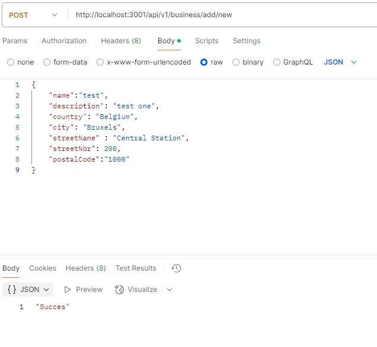

# Estia Project - Backend

This repository contains the backend code for the Estia Project, which provides an API for managing businesses, addresses, users, and reviews.  
Estia is an application that helps families find child-friendly spots like cafes, restaurants, activity centers, etc.  
For the frontend part you can visit the [Project-Estia](https://github.com/Evangelia93/Project-Estia) .

## 📌 Project Overview

- The backend is built using **Node.js** and **Express**.
- **PostgreSQL** is used as the database.
- The API is hosted on **Heroku**.
- **JWT (JSON Web Tokens)** is used for authentication.

---

## ✅ Features Implemented

### 🔹 User Management

- **User Registration**
  - Stores user credentials securely using bcrypt for password hashing.
- **User Login**
  - Uses JWT authentication for secure login.
- **JWT Token Generation**
  - Ensures protected routes require authentication.

### 🔹 Business Management

- **Fetch all businesses**
- **Fetch a specific business**
- **Fetch a business with its address**

### 🔹 Address Management

- **Fetch all addresses**
- **Fetch a specific address**

### 🔹 Reviews

- **Add a review**
  - Allows users to submit a rating and comment for a business.
  - 🛠 _To-Do: Add review deletion and update functionality._

### 🔹 CORS Configuration

- Configured CORS to allow requests only from the frontend application.

### 🔹 Environment Variables

- Stored securely using **Heroku config vars** for:
  - `DATABASE_URL`
  - `JWT_SECRET`

---

## 🛠 Database

Below is the database schema that represents the relationships between different entities in the project.

### 📋 Explanation of Schema:

- **Business**: Stores details of all businesses.
- **User**: Stores user accounts, authentication details, and business ownership (if applicable).
- **Address**: Stores business location details.
- **Reviews**: Users can leave reviews and ratings for businesses.
- **Images**: Stores images associated with businesses.
- **Business Features**: Stores business-specific attributes such as indoor playground, parking space, etc.
- **Favorites**: Allows users to favorite businesses.

---

## 📡 API Endpoints

**Base URL:** `https://estiaproject-b3ef95234cdd.herokuapp.com/api/v1`

### Users

| Method | Endpoint                                      | Description                            |
| ------ | --------------------------------------------- | -------------------------------------- |
| GET    | `/api/v1/users/`                              | Fetch all users (for testing)          |
| GET    | `/api/v1/users/{id}`                          | Fetch user details by ID (for testing) |
| POST   | `/api/v1/auth/register`                       | Register a new user                    |
| POST   | `/api/v1/auth/login`                          | Authenticate a user                    |
| POST   | `/api/v1/users/{id}/add_review/{id_business}` | Add a review for a business            |

### Businesses

| Method | Endpoint                                                          | Description                               |
| ------ | ----------------------------------------------------------------- | ----------------------------------------- |
| GET    | `/api/v1/business/`                                               | Fetch all businesses                      |
| GET    | `/api/v1/business/{id}`                                           | Fetch business details by ID              |
| GET    | `/api/v1/business/{id}/address_details`                           | Fetch business details with address       |
| GET    | `/api/v1/business/{id}/business_features`                         | Fetch business details with features      |
| GET    | `/api/v1/business/{id}/business_reviews`                          | Fetch business details with reviews       |
| POST   | `/api/v1/business/?idBusiness={idBusiness}&isPrimary={isPrimary}` | uploads a picture to a business           |
| POST   | `/api/v1/business/add/new`                                        | add a new business with address           |
| PUT    | `/api/v1/business/update/{idBusiness}`                            | update a business                         |
| GET    | `/api/v1/business/phoros/{id}/?is_primary={is_primary}`           | get the images for a business             |
| GET    | `/api/v1/business/all`                                            | get all business with address and picture |
| POST   | `/api/v1/business/add/new`                                        | Add a new business with address |
| PUT    | `/api/v1/business/update/{idBusiness}`                            | Update business details |
| POST   | `api/v1/business/?idBusiness={idBusiness}&isPrimary={isPrimary}`  |Upload a Picture to a Business |
| GET    | `/api/v1/business/photos/{id}/?is_primary={is_primary}`           |Get the Images for a Business |

### Addresses

| Method | Endpoint               | Description                               |
| ------ | ---------------------- | ----------------------------------------- |
| GET    | `/api/v1/address/`     | Fetch all addresses (for testing)         |
| GET    | `/api/v1/address/{id}` | Fetch address details by ID (for testing) |

## Description of Endpoints created by [Adrian](https://github.com/rotiadi).

### 🖊 Upload a Picture to a Business
- **Method**: `POST`
- **Endpoint**: `/api/v1/business/?idBusiness={idBusiness}&isPrimary={isPrimary}`
- **Parameters** (using `req.query`):
  - `idBusiness` (required) - A number representing the business ID. Must be a valid business ID.
  - `isPrimary` (optional) - Specifies if the uploaded picture is primary (`1`) or not (`0`). Defaults to `0` if omitted.

### 🏢 Add a New Business with Address
- **Method**: `POST`
- **Endpoint**: `/api/v1/business/add/new`
- **Parameters** (using `req.body`):
  - `name` (required) - Business name.
  - `description` (required) - Business description.
  - `country` (required) - Business country.
  - `city` (required) - Business city.
  - `streetName` (required) - Business street name.
  - `streetNbr` (required) - Business street number.
  - `postalCode` (required) - Business postal code.

For **latitude** and **longitude**, the API assigns **default values: `50.8503, 4.3517`**.

  

  ### 🔄 Update Business
- **Method**: `PUT`
- **Endpoint**: `/api/v1/business/update/{idBusiness}`
- **Parameters**:
  - From `req.param`:
    - `idBusiness` (required) - The ID of the business to update.
  - From `req.body`:
    - `name`, `description`, `country`, `city`, `streetName`, `streetNbr`, `postalCode` (all required fields).

### 📷 Get the Images for a Business
- **Method**: `GET`
- **Endpoint**: `/api/v1/business/photos/{id}/?is_primary={is_primary}`
- **Parameters**:
  - From `req.param`:
    - `id` (required) - The business ID. Must be a valid ID.
  - From `req.query`:
    - `is_primary` (optional) - `1` fetches only the primary image, `0` fetches non-primary images. If omitted, returns all images.

## 🚀 Future Goals

These are features planned for future implementation:

### Review Deletion & Editing

- Allow users to delete and update their reviews.

### Business Search & Filters

- Add search functionality for businesses based on name, category, or location.
- Implement rating-based filters.

### Add Favorite Button

- Allows users to favorite businesses.

### Admin Dashboard

- A panel for admin users to manage businesses & users.

### Email Verification on Registration

- Implement email verification for new user signups.

### Frontend Deployment & Integration

- Deploy the frontend separately and ensure it integrates seamlessly with the backend.

---

## 🤖 Contributors

| Name               | GitHub Profile                  | Contributions                                                                   |
| ------------------ | ------------------------------- | ------------------------------------------------------------------------------- |
| **Vasiliki Korai** | https://github.com/vasiliki0217 | Architected and Developed Backend, API, DB Schema, DB Creation & Authentication |
| **Adrian** | https://github.com/rotiadi | Added API endpoints for business operations and image uploads |
